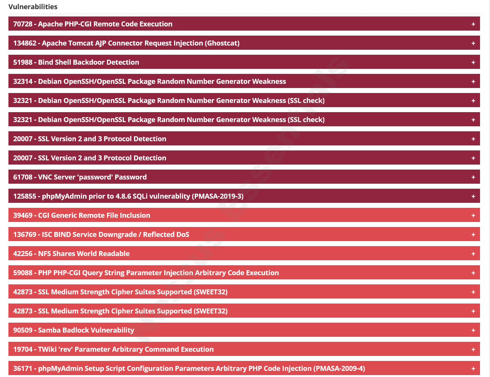
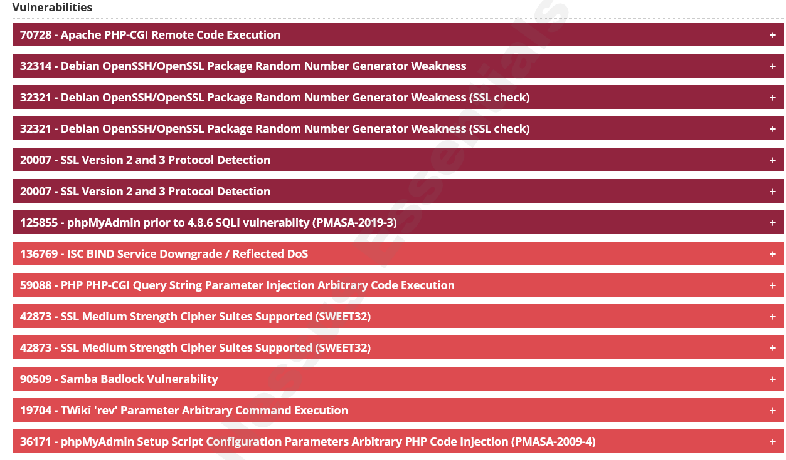
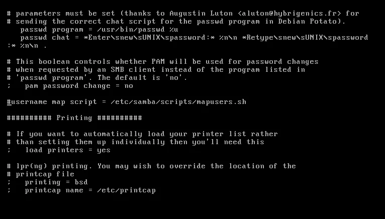

# Hardening-Metasploitable

## Project: Vulnerability Assessment and Remediation Plan for Metasploitable

### Overview
The goal of this project is to identify vulnerabilities within the **Metasploitable machine**, and applications, propose actionable remediation strategies, and ensure secure configuration management.

---

### Network Environment Setup

The network environment consists of two main components: a **Vulnerable Machine** (Metasploitable) and a **Kali Linux Machine** for penetration testing.

#### Network Diagram in EVE

1. **Vulnerable Machine (Metasploitable):**
   - **IP Address:** `10.0.0.10/24`
   - Connected to **Router R1** via interface `e0/0`.
   - This machine was the primary target of the vulnerability scan.

2. **Router R1:**
   - **Interfaces:**
     - `e0/0` connected to the vulnerable machine (`10.0.0.200`).
     - `e0/2` connected to the internet (`192.168.1.10`).
     - `e0/1` connected to another router **R2** (`20.0.0.200`).
   - Acts as the intermediary between the vulnerable machine, the internet, and the internal network.

3. **Switch R2:**
   - **Interfaces:**
     - `e0/1` connected to **Router R1** (`20.0.0.0/24`).
     - `e0/0` connected to the **Kali Machine** for scanning.

4. **Kali Linux Machine:**
   - **IP Address:** `20.0.0.10/24`
   - Connected to **Switch R2** through interface `e0/0`.
   - This machine was used to scan, assess, and exploit the vulnerabilities of the Metasploitable machine.

---

### Project Breakdown

#### **Week 1: Vulnerability Assessment**
**Objective:** Identify and document vulnerabilities across the network.

- Tools Used:
  - Nmap
  - Nessus for vulnerability scanning.
- Actions Performed:
  - Conducted scans on the Metasploitable machine to identify high, medium, and low-risk vulnerabilities.
- Artifacts:
  - Screenshot of Pre-Patch Nmap Scan:
  - 
  - Pre-patch Nessus .html scan report: [Download Here](reports/nessus_pre_patch.html)

  - Screenshot of Pre-Patch Scan:
    

  - Post-patch Nessus .html scan report: [Download Here](reports/nessus_post_patch.html)

  - Screenshot of Post-Patch Scan:
    

---

#### **Week 2: Penetration Testing**
**Objective:** Validate the identified vulnerabilities by exploiting them in a controlled environment.

- Tools Used:
  - Metasploit on the Kali Linux machine.
- Actions Performed:
  - Exploited several critical and high-risk vulnerabilities identified in Week 1.
- Exploits used and results can be found in the presentation 
  [Download Here](reports/presentation.pptx)

---

#### **Week 3: Secure Configuration and Patch Management**
**Objective:** Mitigate vulnerabilities through secure configuration and patching.
- Actions Performed:
  - Edited configuration files to patch exploited vulnerabilities.

- **NFS (111, 2049)**
  - NFS is misconfigured so that it provides full access to its entire root filesystem to all devices on the network. As you can see from /etc/exports down below, ‘*’ basically means that all hosts are allowed to mount the root filesystem which is ill-advised. It is considered best practice to limit access to only necessary hosts and restrict to only necessary directories.
      

- **VNC (5900)**
  - The VNC password for Metasploitable 2 is “password” funnily enough which makes it very easy to brute-force. The VNC password should be changed by using the command vncpasswd.

- **Bindshell (1524)**
  - Due to the last line ingreslock stream tcp nowait root /bin/bash bash -i, potential bad actors can easily spawn a root shell using tools like Meterpreter and Netcat. This line needs to be removed or commented out.

- **SMB (139, 445)**
  - Using MSF6, the exploit exploit/multi/samba/usermap_script gains root access to Metasploitable 2. The exploit can be rendered useless if the line username map script = /etc/samba/scripts/mapusers.sh is commented.

- **Apache Tomcat AJP Connector (8009)**
  - The AJP Connector facilitates communication between Tomcat and the installed web server which in this case is Apache.This particular version of Tomcat installed on Metasploitable 2 is running a vulnerable AJP Connector. This vulnerability can be remediated by adding a secret key in the AJP connector line in /etc/tomcat5.5/server.xml which provides a layer of authentication.
  

---

### Future Hardening Plan
To enhance the security posture of the network, the following measures will be implemented:

1. **Firewall Configuration:**
   - Implement a Next-Generation Firewall (NGFW) with IPS and antivirus profiles.
   - Deploy a Web Application Firewall (WAF) behind the router for additional protection.

2. **Port Security:**
   - Activate port security and enable DHCP snooping on the Cisco switch to prevent unauthorized devices from connecting.

3. **Access Control Lists (ACL):**
   - Configure ACLs on the router to restrict traffic based on IPs, protocols, and ports.

4. **iptables Configuration:**
   - Close unnecessary open ports on the Metasploitable machine.

---
**Special thanks to jai**
  - https://medium.com/@jai38100/hardening-metasploitable-2-52ec0adf48f2

   
