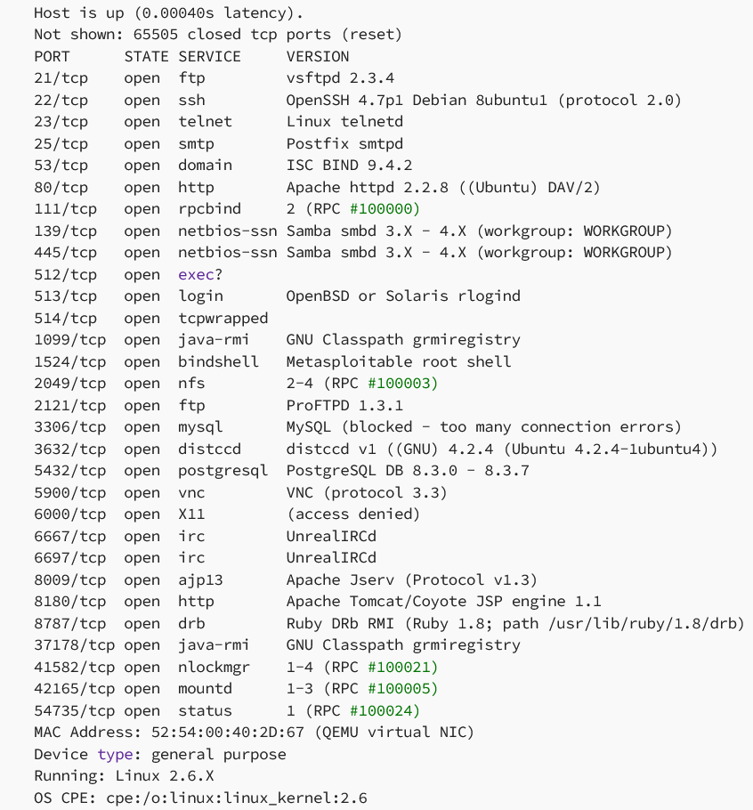

# Hardening-Metasploitable

## Project: Vulnerability Assessment and Remediation Plan for Metasploitable

### Overview
The goal of this project is to identify vulnerabilities within the **Metasploitable machine**, and applications, propose actionable remediation strategies, and ensure secure configuration management.

---

### Network Environment Setup

The network environment consists of two main components: a **Vulnerable Machine** (Metasploitable) and a **Kali Linux Machine** for penetration testing.

#### Network Diagram

1. **Vulnerable Machine (Metasploitable):**
   - **IP Address:** `10.0.0.10/24`
   - Connected to **Router R1** via interface `e0/0`.
   - This machine was the primary target of the vulnerability scan.

2. **Router R1:**
   - **Interfaces:**
     - `e0/0` connected to the vulnerable machine (`10.0.0.200`).
     - `e0/2` connected to the internet (`192.168.1.10`).
     - `e0/1` connected to another router **R2** (`20.0.0.200`).
   - Acts as the intermediary between the vulnerable machine, the internet, and the internal network.

3. **Switch R2:**
   - **Interfaces:**
     - `e0/1` connected to **Router R1** (`20.0.0.0/24`).
     - `e0/0` connected to the **Kali Machine** for scanning.

4. **Kali Linux Machine:**
   - **IP Address:** `20.0.0.10/24`
   - Connected to **Switch R2** through interface `e0/0`.
   - This machine was used to scan, assess, and exploit the vulnerabilities of the Metasploitable machine.

---

### Project Breakdown

#### **Week 1: Vulnerability Assessment**
**Objective:** Identify and document vulnerabilities across the network.

- Tools Used:
  - Nmap
  - Nessus for vulnerability scanning.
- Actions Performed:
  - Conducted scans on the Metasploitable machine to identify high, medium, and low-risk vulnerabilities.
- Artifacts:
  - Screenshot of Pre-Patch Nmap Scan:
  - 
  - Pre-patch Nessus scan report: [Download Here](reports/nessus_pre_patch.html)
  - Post-patch Nessus scan report: [Download Here](reports/nessus_post_patch.html)

---

#### **Week 2: Penetration Testing**
**Objective:** Validate the identified vulnerabilities by exploiting them in a controlled environment.

- Tools Used:
  - Metasploit on the Kali Linux machine.
- Actions Performed:
  - Exploited several high and medium-risk vulnerabilities identified in Week 1.
- **Exploitation Example:**
  

---

#### **Week 3: Secure Configuration and Patch Management**
**Objective:** Mitigate vulnerabilities through secure configuration and patching.

- Actions Performed:
  - Edited configuration files to patch exploited vulnerabilities.
- **Configuration Fix Example:**
  

---

### Future Hardening Plan
To enhance the security posture of the network, the following measures will be implemented:

1. **Firewall Configuration:**
   - Implement a Next-Generation Firewall (NGFW) with IPS and antivirus profiles.
   - Deploy a Web Application Firewall (WAF) behind the router for additional protection.

2. **Port Security:**
   - Activate port security and enable DHCP snooping on the Cisco switch to prevent unauthorized devices from connecting.

3. **Access Control Lists (ACL):**
   - Configure ACLs on the router to restrict traffic based on IPs, protocols, and ports.

4. **iptables Configuration:**
   - Close unnecessary open ports on the Metasploitable machine.

---

### How to Use This Repository
1. Download the Nessus scan reports for detailed vulnerability analysis.
2. Review the provided screenshots for pre-patch and post-patch comparison.
3. Use the documented steps to replicate the environment or apply additional hardening measures.

   
